This is homeworks of Arbitrum x HackQuest Rust colearning.

## MetaMask configuration

1. Add MetaMask extention to the brower

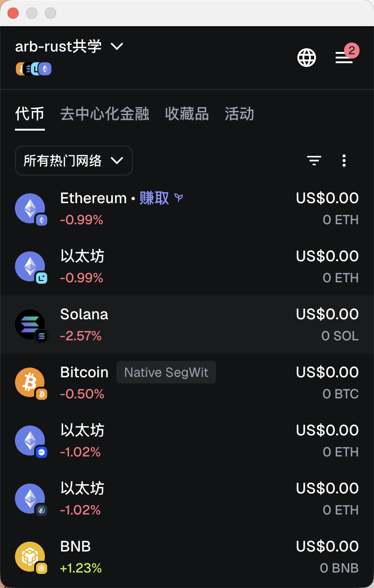

2. Switch to Aribitrum Sepolia Testnet

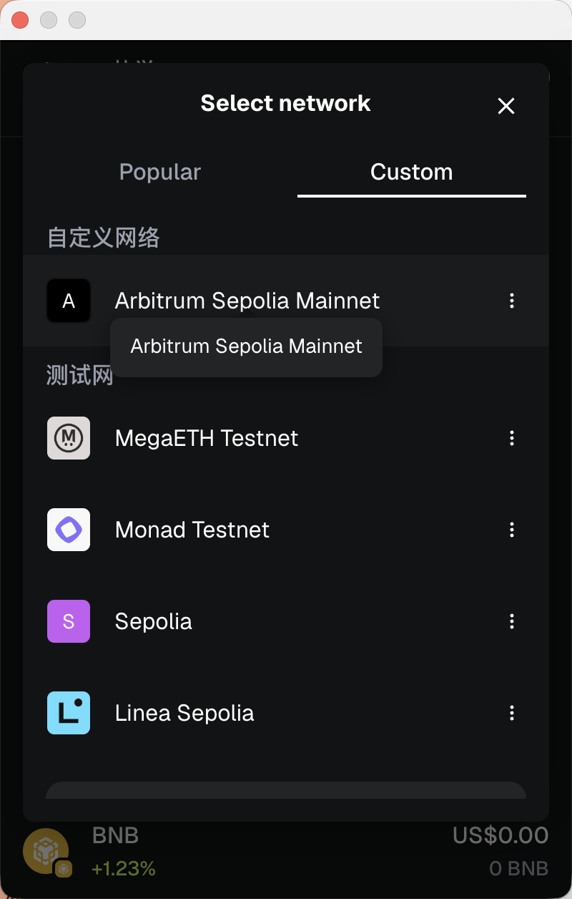

3. Get test coin from faucet

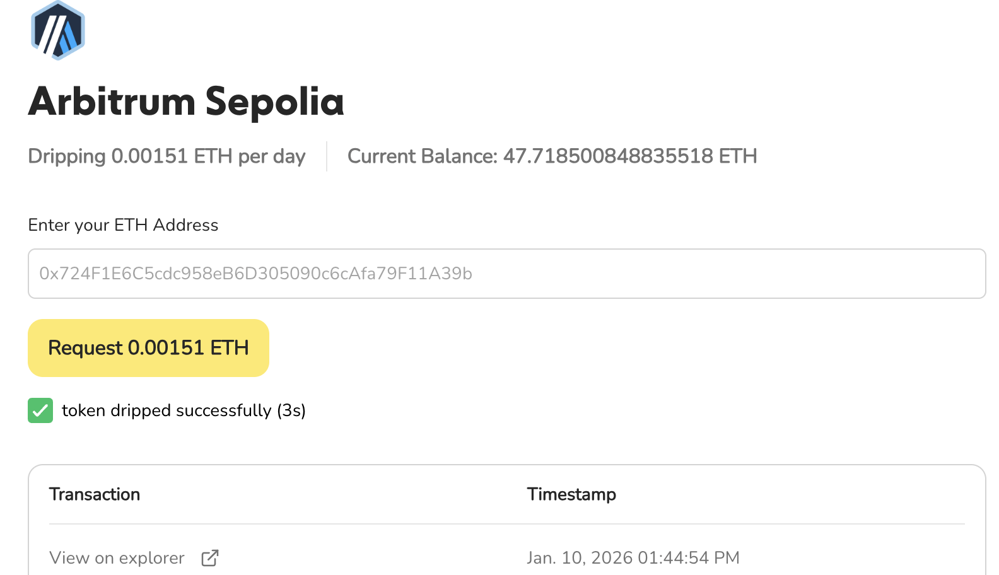

4. Ready for the journey!

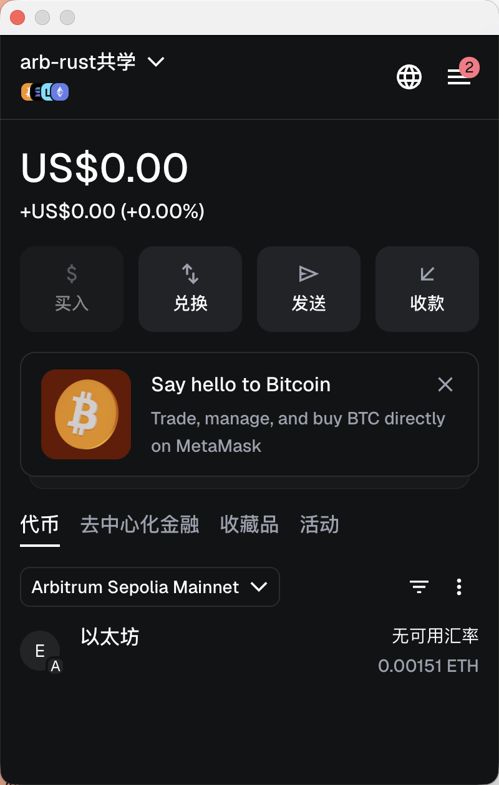

## Task1: Hello Web3

In `src/task1_hello_web3/hello.rs`, we connect to Aribitrum Sepolia Testnet, get the latest block number, and invoke the smart contract HelloWeb3. By running `cargo run`, we have the output:

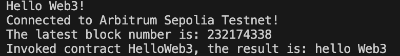

## Task2: Balance Query

In `src/task2_balance_query/balance.rs`, we connect to Aribitrum Sepolia Testnet, query the balance of the address, convert it from Wei to ETH and finally return. The running result is:

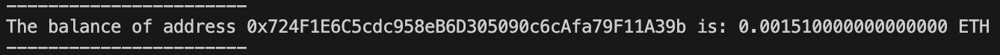

## Task3: Gas Price

In `src/task3_gas_price/price.rs`, we get the latest gas price, estimate the fee of a transfer, and present the result in Gwei and ETH.

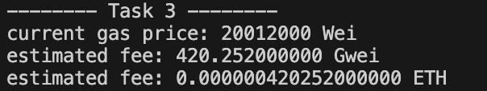

## Task4: Transfer

In `src/task4_transfer/transfer.rs`, we transfer `amount_eth` ETH to address `to_address_str`.

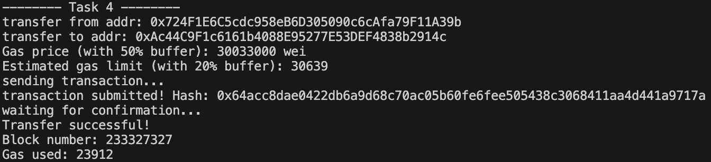

Note that we manually set set price and gas limit. To make sure the transaction will be accepted, we add a +50% buffer on gas price and +20% buffer on gas limit. In practice, the automatic configuration is already enough.

## Task5: Contract

We first look for a contract deployed on Arbitrum Sepolia. Search WETH (token) on [block explorer](sepolia.arbiscan.io), we get [this link](https://sepolia.arbiscan.io/token/0x980b62da83eff3d4576c647993b0c1d7faf17c73#readProxyContract) and the contract address is `0x980B62Da83eFf3D4576C647993b0c1D7faf17c73`.

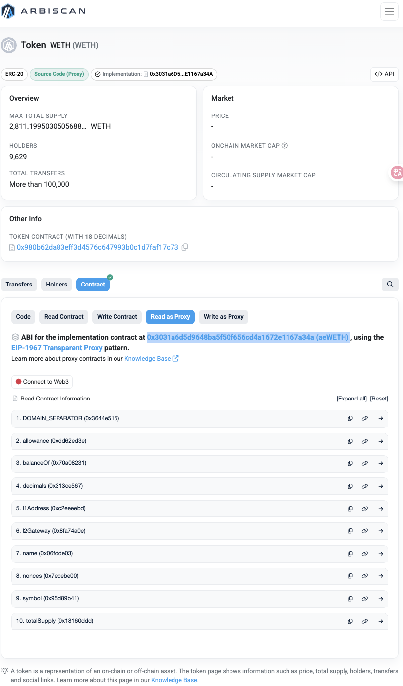

However this is a proxy contract, the real contract should be found in "Read as Proxy" button. The real contract address is `0x3031a6D5D9648BA5f50f656Cd4a1672E1167a34A`. We can find contract ABI [here](https://sepolia.arbiscan.io/address/0x3031a6d5d9648ba5f50f656cd4a1672e1167a34a#code):

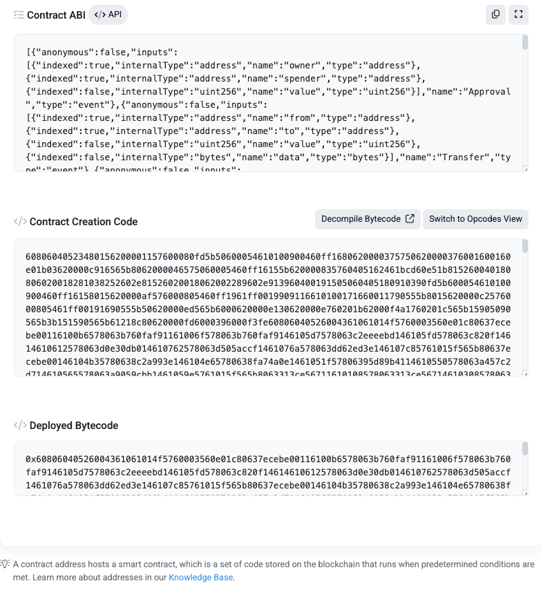

We use the ABI of the real contract (in `src/task5_contract/weth_abi.json`), but invoke the contract from the proxy address. This is because the real contract does not implement the token name and token symbol fields, so if we invoke the real contract address, the token name and symbol are empty. The result is:

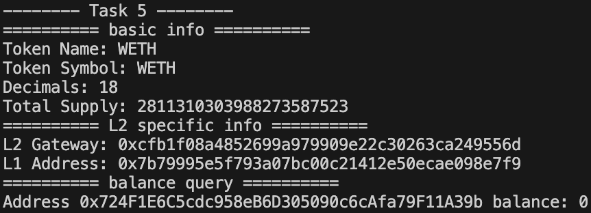

